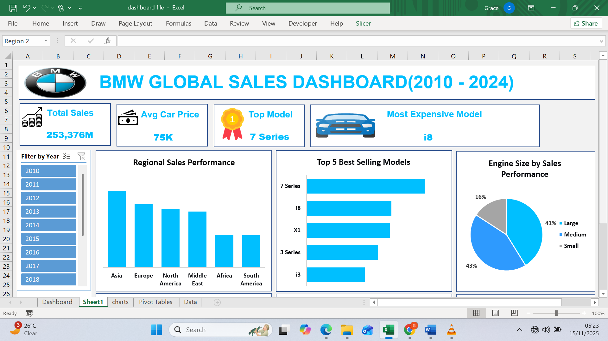

# BMW Global Sales Dashboard (2010–2024)

## Dashboard Preview

## Project Overview
This project analyzes BMW vehicle sales data from 2010 to 2024 across global regions.
The goal was to clean, transform, and visualize the data to uncover trends in sales performance,
pricing, customer preferences, and regional performance.

## Dataset Description
The dataset includes the following columns:
- Model
- Year
- Region
- Color
- Fuel Type
- Transmission
- Engine Size (L)
- Mileage (KM)
- Price (USD)
- Sales Volume
- Sales Classification

## Data Cleaning & Transformation
- Removed duplicates and handled missing values
- Standardized region, fuel type, and model names
- Created calculated fields:
  - Revenue = Price × Sales Volume
  - Engine Size Category (Small, Medium, Large)
  - Sales Performance Classification (Low, Medium, High)
- Converted numeric values to readable formats (K & Millions)

## Key Insights
- Asia leads global sales performance, followed by Europe
- South America recorded the lowest sales
- Average car price is $75K
- Best-selling model: BMW 7 Series
- Most expensive model: BMW i8
- Medium engine sizes dominate sales performance
- Revenue peaked in 2022, dipped in 2023, and recovered in 2024
- Red, Silver, and White are the best-selling colors
- Electric and Diesel vehicles have the highest average prices

## Tools Used
- Microsoft Excel
  - Pivot Tables
  - Pivot Charts
  - Slicers
  - Conditional Formatting

